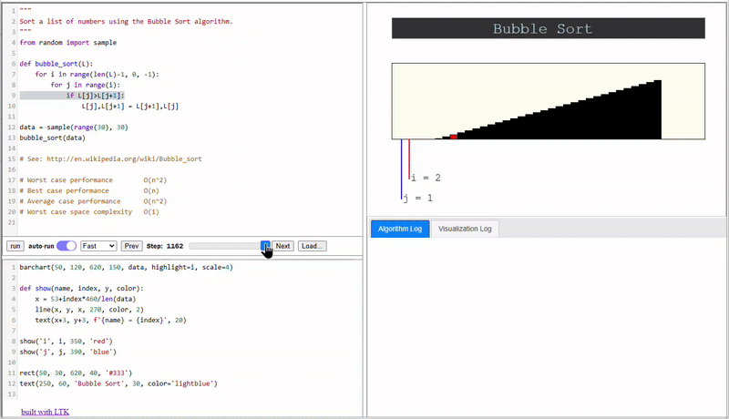

# PyAlgoViz

This is the PyScript version of [PyAlgoViz](https://github.com/laffra/pyalgoviz).

A live preview is hosted at [Github Pages](https://laffra.github.io/pyalgoviz-pyscript?name=bubblesort).

# Using MicroPython for fast startup

The UI of PyAlgoViz is written in Python, using PyScript/LTK. 
See [main.py](main.py) for the logic. LTK is desiged in such a way
that it uses minimal Python APIs, so it can easily run in MicroPython.

MicroPython is a version of Python that runs in constrained environments,
such as microcontrollers. But, it is also bundled by PyScript, so it
can be used to run small Python apps in the browser. The total footprint
of MicroPython is around 240K bytes. It downloads fast, and loads fast.

Once the UI is created, a worker is created, and the worker is used
to run the algorithms. The main thread on MicroPython talks with the worker
using publish/subscribe message, very similar to Kafka.

# Using PyOdide in a worker 

The main thread creates the PyOdide worker. It receives a couple 
of Python modules needed to run the algorithms and visualize them.
When the algorithm is executed in the worker, the following happens:

- First, the worker installs a `sys.settrace` function
- Then, it runs the algorithm using `exec`.
- Each line that is executed anywhere triggers the trace function.
    - If the reported file is not the script we are running, we ignore it.
    - Otherwise, we run the visualization code. 
    - The resulting visualization is saved.

The result is that we produce an image for each executed line.
When these frames are played back in sequence, we visualize
the algorithm. At the end of the run, the visualization is sent
back to the main thread using the publish/subscribe mechanism.

# Rendering the visualization

The main thread receives the visualization and renders it. It 
shows a movie where each frame is keyed to a line of code. The control section is updated to show
progress when it renders a specific frame. In addition, the current line in the source code editor 
is highlighted. For performance reasons, the visualization of a frame is not rendered in 
Python but in JavaScript. This is 
due to the overhead FFI calls have between Python and JavaScript.
This makes numerous DOM access calls expensive unless they are 
bundled into one.

# Contributing a new visualization

Visualizations are written in Python. They are saved in the `visualizations`
folder. Each visualization is a Python module that exports two functions.
The script can be written in PyAlgoViz and then copied to a local file,
to add it to the PyAlgoViz repository on GitHub. We welcome PRs with
new visualizations.

To get started, see the existing visualizations such as 
[bubblesort.py](visualizations/bubblesort.py) and
[mergesort.py](visualizations/mergesort.py).

# Summary

This small application, about 450 lines of Python, performs a careful
dance between three VMs: The JavaScript VM, the MicroPython VM, and the
PyOdide worker VM. Information between the worker and main thread is 
done by PyScript using a publish/subscribe mechanism. The main thread
and JavaScript VM communicate using the Foreign Function Interface (FFI).

When the main thread creates the UI, it leverages PyScript LTK. This is
a UI toolkit written in Python, where widgets are a thin layer around
jQuery elements to create layouts, set CSS styling, and handle events.
The state of PyAlgoViz is kept in one single model, and where appropriate,
the UI is using the Reactive capabilities of LTK, to avoid having
to use event handlers.

